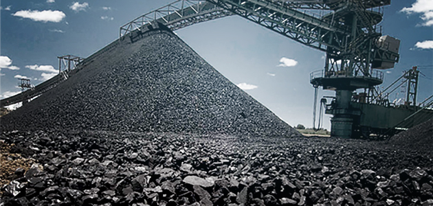

# Bitcoin AINDA não é vilã dos preços de commodities.

Autor: Hsia Hua Sheng (Professor de Finanças Aplicadas da FGV-EAESP)

Data 11/Dez/2017

Os preços de commdities de carvão, minério de ferro e aços tiveram uma queda expressiva no mercado chinês na semana passada. Os preços futuros também sugeriram um cenário de queda nos preços desses commodities no curtíssimo prazo! E nessa mesma semana, o mundo conheceu mais uma escalada espetacular da valorização da Bitcoin! E hoje inicia negociação de contrato de derivativo de Bitcoin no Chicago Board Options Exchange (CBOE)!!!

Fonte: Google Imagens com acesso livre.

Será que os investidores estão abandonando investimentos em economia tradicional e indo para mercado especulativo de Bitcoin? Uma vez que o recurso de investidores é limitado, eles podem começar a vender seus ativos tradicionais com fundamentos econômicos e financeiros e ir “investir“ em Bitcoin que oferece emoções, emoções e mais emoções!!!!

Essa briga de recursos de investidores pode até acontecer entre alguns produtos de mercado de commodities e Bitcoin, mas não é o caso de commoditie de carvão, minério de ferro e aço. Por enquanto, o argumento fundamentalista ainda prevalece.

O governo chinês começou a intensificar sua política de sustentabilidade e economia verde para China. O objetivo é reduzir uso de carvão para reduzir a poluição e aumento do uso de energia verde alternativa como gás natural, solar, eólica e etanol... Essa política verde está sendo implementada não só nas cidades, mas também nas áreas rurais. As indústrias, empresas, órgão público, escolas e famílias são incentivados a adotarem energia mais limpa. Por isso, mesmo com a chegada de inverno, os preços de carvão à vista e futuro caíram, pois as energias alternativas já começaram a ajudar os chineses se proteger de frio.

A política economia verde também reduziu produção de aço e preço de minério de ferro. Mais fabricas de aços poluidoras são fechadas. Antes, essas fábricas levavam suspensão temporária de produção, agora as fabricas que não aderiram as normas ambientais de produção limpa são fechadas pelo governo chinês. Além disso, o setor de construção da China também está sofrendo com alta de taxas de juros na China. Por isso, com a demanda de aços em queda, os preços de minério também sofreram queda.

Portanto, Bitcoin ainda não está afetando preços desses commodities sob perpectiva fundamentalista. Mas, isso não vai durar por muito tempo... como a Bitcoin consome uma quantidade absurda de energia elétrica ser “fabricada”, logo veremos uma briga por energia elétrica e aumento custos para todos!!!!!

© 2017 Hsia Hua Sheng All Rights Reserved / © 2017 Hsia Hua Sheng todos os direitos reservados

Para citação desse artigo: SHENG, H.H. “Bitcoin AINDA não é vilã dos preços de commodities”. Série de Estudo de International Financial Mangement (Instituto de Finanças, FGV-EAESP), No. 5, 11/12/2017, São Paulo.

Quer participar do Projeto “Ideias que Transformam”? Se você é aluno ou ex-aluno da FGV EAESP e tem “ideias que transformam” para compartilhar, envie seu artigo para o e-mail ideiasquetransformam@fgv.br. Caso seja escolhido, seu artigo poderá ser promovido pela escola e ganhar muitos leitores. http://www.fgv.br/eaesp/cursos/hsia-sheng/
