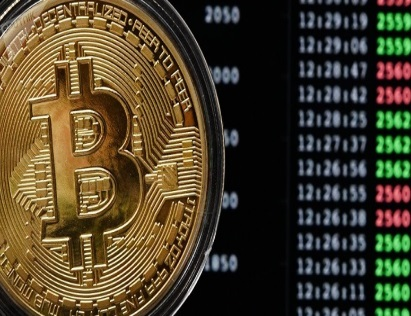

# Pizzacoin ou Bitcoin?

Autor: Hsia Hua Sheng (Professor de Finanças Aplicadas da FGV-EAESP)

Data 18/Dez/2017

O que você faria para salvar uma empresa de alta tecnologia em dificuldade financeira? Se sua resposta é reduzir custo, ou downsizing, ou aumentar eficiência e receita, ou aumentar compartilhamento de serviços, ou fazer reestruturação com fusões e aquisições, ou fazer Sell-off ou Spin-off, então você vai conhecer mais uma resposta: criar própria moeda digital da empresa.

Uma empresa de alta tecnologia chinesa listada na bolsa de valores teve essa ideia no início de 2017. A empresa estava começando a enfrentar a dificuldade financeira, pois seu principal produto de prover cálculo potente compartilhado na nuvem não vendia tanto quanto a empresa planejava. A solução encontrada é converter seu programa de fidelidade para uma espécie de Criptomoeda. Assim, os clientes da empresa não usariam mais seus pontos de cupons de desconto “da loja”, e sim usariam essas moedas para contratar e aumentar mais velocidade de cálculos na nuvem.

Fonte: Google Imagens com acesso livre. Artigo: SHENG, H.H. “Pizzacoin ou Bitcoin?”.

Na verdade, essa criptomoeda só pode ser negociada em plataforma de negociação para consumir produtos oferecidos pela empresa emissora. No entanto, para aumentar interesse de potenciais compradores a sua moeda, a empresa emissora acaba destacando as características tecnológicas de suas criptomoedas: a tecnologia Blockchain, uso de equipamento de “mineração” para sua produção, quantidade limitada e programada de moedas. Como esses aspectos tecnológicos são muito semelhantes às mesmas características da Bitcoin, pessoas acabam se confundindo e começam trata-los como se fosse Bitcoin.

O resultado dessa criação foi surpreendente para essa empresa. A ação dessa empresa acumulou uma valorização de 70% em 15 dias. Sua Criptomoeda que valia RMB$ 0,10 (dez centavos) no inicio da oferta, em 40 dias, ela vale mais que RMB$ 8,00. E suas ações passaram a oscilar conforme as oscilações de preço de sua moeda.

Essa valorização absurda segue o mesmo racional especulativo de Bitcoin. Quanto preço da moeda mais valoriza, mais pessoas comentam nas redes sociais, mais pessoas curiosas querem comprar. Como todos sabem que a regra de jogo de especulação é “vender para alguém um preço maior que você comprou” e ninguem quer ser os ultimos a saírem do jogo, então todos querem comprar e negociar primeiro, preço de mercado aumenta absurdamente em pouco espaço de tempo. Para sustentar esse preço absurdo, é preciso uma continuação de comentários de redes sociais para que tenha mais pessoas entrando para sustentar mais um aumento absurdo de preço. Se esse corrente quebrar, a queda de preço também será absurdo em alguns segundos...

Devido a esse “espetáculo financeiro” imediato, infelimente, essa empresa perdeu rumo de seu principal produto e modelo de negócio que pode beneficiar milhões de usuarios na economia real. Imagine agora se essa moda pega... Quem vai fazer as deliciosas pizzas que todo mundo adora? Se as pizzarias podem emitir os próprios Pizzacoin!!!!!

© 2017 Hsia Hua Sheng All Rights Reserved / © 2017 Hsia Hua Sheng todos os direitos reservados

Para citação desse artigo: SHENG, H.H. “Pizzacoin ou Bitcoin?”. Série de Estudo de International Financial Mangement (Instituto de Finanças, FGV-EAESP), No. 6, 18/12/2017, São Paulo.

Quer participar do Projeto “Ideias que Transformam”? Se você é aluno ou ex-aluno da FGV EAESP e tem “ideias que transformam” para compartilhar, envie seu artigo para o e-mail ideiasquetransformam@fgv.br. Caso seja escolhido, seu artigo poderá ser promovido pela escola e ganhar muitos leitores. http://www.fgv.br/eaesp/cursos/hsia-sheng/
