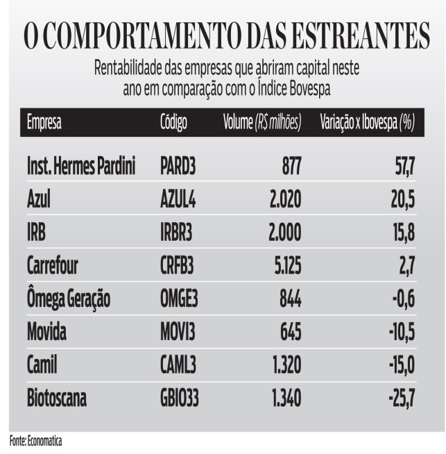
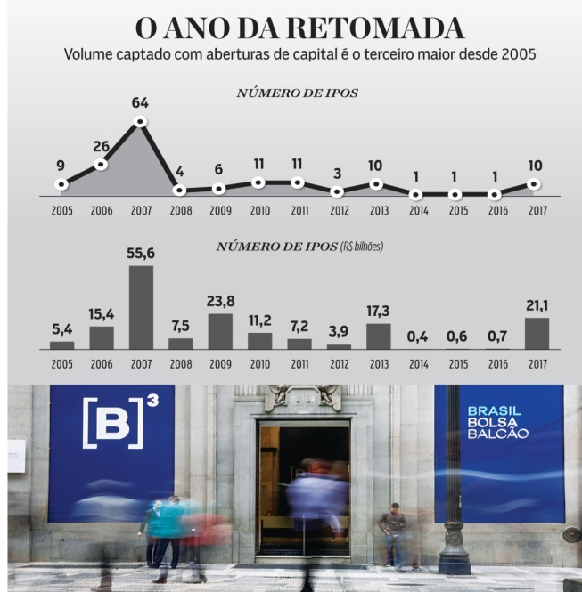

# Mais venda de carros de Luxo em 2018!!!

Autor: Hsia Hua Sheng (Professor de Finanças Aplicadas da FGV-EAESP)

Data 25/Dez/2017

Feliz Natal!!! Muita comemoração no mercado de capitais no mundo!!! Não só recuperação e perspectiva de estabilidade econômica dos principais economias do mundo, mas também dinheiro abundante e barato nos Estados Unidos, Japão e Europa também impulsionaram o mercado de fusões e aquisições. O ano de 2017 ficará marcado pelo um dos melhores anos das operações de abertura de capital (IPO) desde 2007. E o Brasil e China estão dentro!!!

De acordo com a revista isto é dinheiro, as empresas brasileiras estão retomando captações de recursos via mercado de IPOS. Desde janeiro, dez empresas já tocaram o sino no pregão da Bolsa, captando R$ 21,4 bilhões (ou aproximadamente US$ 6,9 bilhões). As duas últimas do ano foram BR distribuidoras e Burguer King. Não há uma concentração de IPO em um determinado setor, mostrando necessidade geral de injeção de capital novo ou de mudança de controlador nas empresas brasileiras.

Fonte: Revista Isto é dinheiro, “Tanque cheio para investidores”, autora: Priscilla Arroyo, 15/12/2017. https://www.istoedinheiro.com.br/tanque-cheio-para-os-ipos/

Já no outro lado do mundo, a China também bateu seu recorde de IPO desde 2010. Em 2017, 482 empresas fizeram IPOs dentro da China e fora da China. O total de recurso levantado foi de U$ 55,1 bilhões (Dentro da China foi US$ 37 bilhões e fora da China foi de U$ 18,1 bilhões). As empresas dos setores de finanças, alta tecnologia, manufaturas relacionada com a indústria 4.0 e matérias renováveis lideraram essa onda de IPOs.

Diferente das empresas estreantes brasileiras, as empresas chinesas conseguiram vender “caro” suas ações no IPO. Em média, os múltiplos de lucro antes de juros, impostos e depreciação e amortização (EBITDA) das empresas chinesas ficaram bem acima de 10 vezes, enquanto os múltiplos das empresas brasileiras ficaram em torno de 7 vezes. Por exemplo, BR distribuidora. Essa diferença de preço não pode ser atribuída só pelas diferenças de setor entre empresas estreantes brasileiras e chinesas, pois uma empresa semelhante à de BR distribuidor, a rede de postos de combustível Ipiranga, foi negociada por 11,4 vezes uns anos atrás.

Portanto, há mais espaço para mais estreantes brasileiras no IPO e melhor preço em 2018!!! A questão X será processo eleitoral e a definição de cenário político nacional que conduzirá economia brasileira nos próximos anos. Uma melhora na perspectiva política e econômica, haverá mais crescimento, mais emprego, mais inovação tecnológica, mais negócios e mais dinamismo na economia!... E mais vendas de carros de Luxo no Natal de 2018!

© 2017 Hsia Hua Sheng All Rights Reserved / © 2017 Hsia Hua Sheng todos os direitos reservados

Para citação desse artigo: SHENG, H.H. “Mais venda de carros de Luxo em 2018!!!” Série de Estudo de International Financial Mangement (Instituto de Finanças, FGV-EAESP), No. 7, 25/12/2017, São Paulo.

Quer participar do Projeto “Ideias que Transformam”? Se você é aluno ou ex-aluno da FGV EAESP e tem “ideias que transformam” para compartilhar, envie seu artigo para o e-mail ideiasquetransformam@fgv.br. Caso seja escolhido, seu artigo poderá ser promovido pela escola e ganhar muitos leitores. http://www.fgv.br/eaesp/cursos/hsia-sheng/
