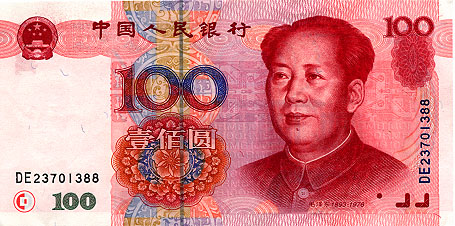

# Quer pagar quanto no Petróleo? Aceitamos em RMB!

Autor: Hsia Hua Sheng (Professor de Finanças Aplicadas da FGV-EAESP)

Data 01/Jan/2018

Feliz Ano Novo 2018!!! Um ano desafiador para determinação ou “precificação” de preço futuro de petróleo, uma das commodities mais negociadas no mundo! Atualmente, os contratos futuros mais líquidos e mais negociados são denominados em US$ e são transacionados nas Bolsas dos Estados Unidos e Europa. Mas, isso pode mudar a partir de 2018!!!

No dia 18/01/2018, a Bolsa de Futuro de Xangai começará a negociar contrato futuro de petróleo em Yuan Chinês CNY ou Renmimbi (RMB)? . Em vez de comprar e vender petróleo em $US, as empresas e investidores têm mais uma alternativa de negociar petróleo em RMB tanto no mercado de entrega imediata (à vista) quanto no mercado de entrega futuro. As empresas podem fazer hedge ou proteção de preço em RMB enquanto que os investidores podem usar esses contratos de derivativos para fazer estratégia de trading.

Fontes: Internet com acesso público no Google

Apesar do ganho de RMB como moeda de reserva global, pouca gente tem familiaridade com sua conversibilidade e taxa de cambio no comercio e investimento internacional. Para aumentar a credibilidade desses contratos, as empresas e investidores também podem converter seu contrato de futuro de petróleo em RMB para contrato de ouro na Bolsa de Xangai. Assim, na ultima instancia, o preço petróleo está atrelado em ouro.

A Bolsa chinesa sabe que não será uma tarefa fácil de gerar liquidez e volume para negociar petróleo no mercado futuro de Xangai, embora China seja o maior importador de petróleo no mundo. Vários casos importantes demonstram embasamento dessa preocupação. Japão como um dos importantes importador do mundo também não conseguiu elevar volume de negociação de contrato de petróleo em Yuen Japones (JPY) na Bolsa de Tokyo Commodity Exchange (TOCOM). Líder de exportação mundial de açúcar, metade de comercial global, o Brasil também teve dificuldade de fazer seu contrato de açúcar decolar.

Esta será mais um desafio da internacionalização da moeda chinesa junto com o projeto de cooperação internacional “One Belt, One Road” da China. Vários países na Ásia já começaram a usar mais RMB nas suas negociações de comercio internacional e regional, inclusive os exportadores de commodities de petróleo. Essa intensificação do uso de RMB ajuda aumentar chance de sucesso do contrato.

Esse também será um desafio para empresas petrolíferas no Brasil. Se negociação em RMB for mais vantajosa financeiramente e economicamente para essas empresas, por que não usá-la no contrato? Quer pagar quanto no petróleo? Aceitamos em RMB.

© 2018 Hsia Hua Sheng All Rights Reserved / © 2018 Hsia Hua Sheng todos os direitos reservados

Para citação desse artigo: SHENG, H.H. “Quer pagar quanto no Petróleo? Aceitamos em $RMB !” Série de Estudo de International Financial Mangement (Instituto de Finanças, FGV-EAESP), No. 8, 01/01/2018, São Paulo.

Quer participar do Projeto “Ideias que Transformam”? Se você é aluno ou ex-aluno da FGV EAESP e tem “ideias que transformam” para compartilhar, envie seu artigo para o e-mail ideiasquetransformam@fgv.br. Caso seja escolhido, seu artigo poderá ser promovido pela escola e ganhar muitos leitores. http://www.fgv.br/eaesp/cursos/hsia-sheng/
