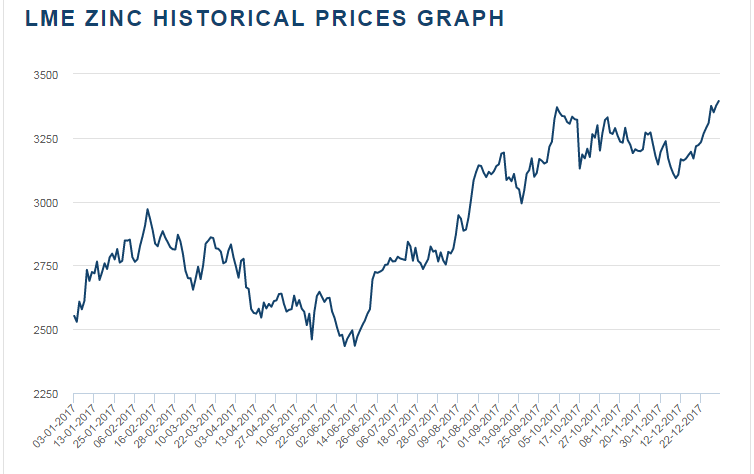

# Cadê empresas listadas que produzem zinco?

Autor: Hsia Hua Sheng (Professor de Finanças Aplicadas da FGV-EAESP)

Data 08/Jan/2018

Diferentemente de preço de minério de ferro que ficou “zero a zero” em 2017, o preço de metal não ferrosos vem subindo nos últimos meses. A previsão é o preço continua em alta nos próximos meses. O Zinco tem liderado nesse grupo de metais (valorização de 30% em 2017), uma vez que ele tem amplas aplicações na indústria automobilística para proteger contra corrosão de carroceria. Ele também será uma das estrelas na nova era de carros elétricos, pois a bateria de zinco já supera bateria de lítio em termos de eficiência e custo.

Fonte: LME e Google Imagem

Há dois principais motivos para esse aumento de preço. Primeiro é o enfraquecimento de US$ dólar frente as outras moedas globais. O enfraquecimento do US dólar está alinhado com o objetivos do Presidente americano Trumpt de fazer América gigante de novo. Dólar americano mais fraco favorece exportações e reduz importações, incentivando atração de investimento estrangeiro e produção interna dos Estados Unidos. Os recentes dados da Europa e da Ásia também demonstra fortalecimento de economia nessas regiões, aumentando valor das moedas dessas regiões, e enfraquecendo ainda mais o US dólar. Consequentemente, US$ dólar fraco é sinônimo de aumento de preço de commodities mundiais.

O segundo motivo vem do lado de oferta e demanda do Zinco. O déficit está no lado de oferta. A China é maior produtor mundial. Mas, com a maior preocupação do governo Chinês em controlar, fiscalizar e combater indústrias e mineradoras poluidoras, várias empresas chinesas se quer começou a produzir zinco este ano. A qualidade de zinco chinês também é relativamente baixa. É necessária que faça um “melhoramento” de qualidade de zinco chinês aumentando o custo da produção.

As outras regiões do mundo tais como Canada, Índia e América Latina também não aumentaram a produção. Isso significa que esse grande déficit de produção continua este ano pressionando aumento de preço. Essa pressão de alta de preço já aumentou peço de ações das principais produtoras de minérios. Na China, as ações dessas empresas chegaram a valorizar 50% pela perspectivas boas desse minério no mercado mundial deste ano.

A festa também chegou no Brasil! A Votorantim metal, a maior empresa produtora de Zinco no Brasil, tem aumentado significativamente seu lucro desde terceiro trimestre de 2017. Mas, infelizmente, essa festa ainda é para poucos... Quem sabe? Um dia Votorantim metal resolve fazer IPO para felicidade de pequenos investidores brasileiros!!!!

© 2018 Hsia Hua Sheng All Rights Reserved / © 2018 Hsia Hua Sheng todos os direitos reservados

Para citação desse artigo: SHENG, H.H. “Cadê empresas listadas que produzem zinco?” Série de Estudo de International Financial Mangement (Instituto de Finanças, FGV-EAESP), No. 9, 08/01/2018, São Paulo.

Quer participar do Projeto “Ideias que Transformam”? Se você é aluno ou ex-aluno da FGV EAESP e tem “ideias que transformam” para compartilhar, envie seu artigo para o e-mail ideiasquetransformam@fgv.br. Caso seja escolhido, seu artigo poderá ser promovido pela escola e ganhar muitos leitores. http://www.fgv.br/eaesp/cursos/hsia-sheng/
