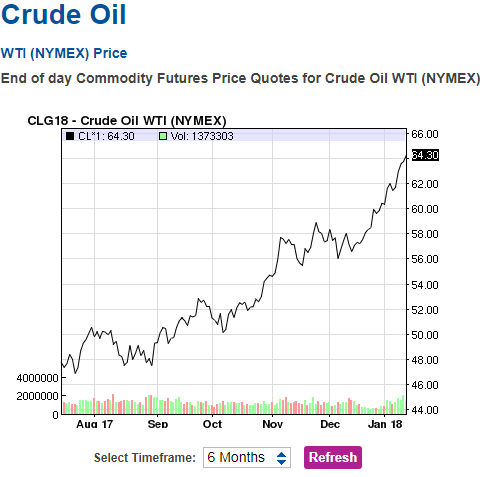
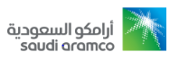

# Petrobras na festa da IPO Saudi Aramco!!!

Autor: Hsia Hua Sheng (Professor de Finanças Aplicadas da FGV-EAESP)

Data 15/Jan/2018

Preço do petróleo bateu mais uma vez seu recorde nos últimos 3 anos. Petróleo WTI futuro chgou a ser negociado 64,77 US$/Barril. So nessa ultima semana (Entre 08/01 e 12/01), o ganho acumulado foi de 5%. E o preço de petróleo vem subindo há cinco semanas seguida.

Será que vai subir mais? A resposta vai depender mais dos Estados Unidos, pois as intenções das demais grandes produtores mundiais estão transparentes.

Fonte: Google e http://www.nasdaq.com/markets/crude-oil.aspx

O posicionamento dos membros de OPEC (ou OPEP) é claro: continuar manter volume de produção reduzido para ter maior controle sobre o preço internacional petróleo. A Russia como um dos maiores produtores dos países não OPEC também está comprometida com essa política. Essa visão coincidente demonstra a força de aliança energética firmada entre Rei Salman bin Abdulaziz Al Saud e Presidente Vladimir Putin na histórica visita do Rei Salman à Russia em outubro de 2017.

A possibilidade de uma de uma aliança mais forte (ou até criação de uma nova associação única) entre membros OPEC e membros não OPEC alimenta ainda mais a tendência de aumento de preço de petróleo. A equação é simples: maior poder de mercado, maior controle de preço da associação, maior aumento de preço. E a soma de participação de mercado dessas duas associações representa quase 85% do mercado de petróleo global.

Além disso, a determinação da Saudi Aramco (a companhia petrolífera estatal do Reino da Arábia Saudita) em fazer maior IPO da história em 2018 fornece mais “combustível” para sustentar alta de petroléo em 2018. Afinal de conta, ninguém gostaria de vender sua empresa quando os preços de seus produtos e rentabilidade da empresa estão em baixo. Pela estimativa atual, essa IPO seria para 5% dessa empresa que levantaria US$ 100 bi. Ate hoje, a maior IPO foi a de Alibaba com US$ 25bi US$.

A indecisão da escolha de local IPO da Aramco também demonstra o esforço da Arábia Saudita em manter estabilidade de preço de petróleo nos próximos 10 e 20 anos. Uma escolha natural e logica seria listar Aramco em Nova York ou em Londres, pois são considerados com maiores centros financeiros globais da atualidade e apresentam maiores múltiplos P/E nesse setor. Mas, essa escolha não é só logica financeira, mas também geopolítico. É escolha de um parceiro estratégico que vai dividir riscos e rentabilidade do negócio do petróleo com Arábia Saudita. Quem seria esse outro candidato? A Bolsa de Hong Kong, representando interesse da China. Se a Hong Kong for escolhida, este será mais um sinal do fortalecimento da parceria entre Arábia Saudita, Russia e China.

Portanto, só faltam Governo Trump e os produtores dos Estados Unidos para definir se a festa continua ou não .... E, nossos pequenos investidores brasileiros já estão junto com a Petrobras para aproveitar a festa!!!

© 2018 Hsia Hua Sheng All Rights Reserved / © 2018 Hsia Hua Sheng todos os direitos reservados

Para citação desse artigo: SHENG, H.H. “Petrobras na festa da IPO Saudi Aramco?” Série de Estudo de International Financial Management (Instituto de Finanças, FGV-EAESP), No. 10, 15/01/2018, São Paulo.

Quer participar do Projeto “Ideias que Transformam”? Se você é aluno ou ex-aluno da FGV EAESP e tem “ideias que transformam” para compartilhar, envie seu artigo para o e-mail ideiasquetransformam@fgv.br. Caso seja escolhido, seu artigo poderá ser promovido pela escola e ganhar muitos leitores. http://www.fgv.br/eaesp/cursos/hsia-sheng/
