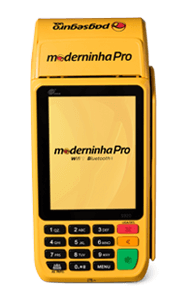

# Próximo desafio da PagSeguro?

Autor: Hsia Hua Sheng (Professor de Finanças Aplicadas da FGV-EAESP)

Data 29/Jan/2018

PagSeguro quer ser uma gigante no meio de pagamento digitais como Paypal, Alipay, Wechat pay e Square, e não quer ser mais uma empresa credenciadora de cartões como é conhecido hoje por seu modelo inovador de “maquininhas” para transação de débito e crédito.

Mas, será que a empresa PagSeguro está preparada para próximo desafio? Ela vai conseguir manter ou aumentar ainda mais seus múltiplos de IPO que é de 25 vezes o lucro estimado para este ano? Uma possível resposta é olhar o que as empresas asiáticas de meio de pagamento estão fazendo para aumentar rentabilidade e garantir crescimento do negócio.

Na semana passada, enquanto PagSeguro estava fazendo seu IPO na Bolsa de Nova York (Nyse), o grupo chinês Tencent, a controladora da Wechat pay, assinou uma parceria estratégica com Carrefour da China. Essa parceria envolve não só a parceria com a plataforma digital de venda, mas também a aquisição de uma parte de ações da Carrefour China por grupo Chinês.

Fonte: Google / Acesso livre

Essa é uma grande conquista para grupo Tencent rumo ao novo modelo de negocio na era de meio de pagamento digital. Uma empresa de meio de pagamento digital só terá crescimento e aumento de rentabilidade sustentável no longo prazo, se conseguir “materializar” e cultivar o habito de usar seu meio de pagamento nos dias e dia de consumidor, seja por meio digital ou meio físico.

Aliança e investimento estratégico com grandes redes de supermercado com lojas físicas é melhor forma de garantir sua presença nas compras diárias dos consumidores. Por exemplo, essa não é primeira aquisição parcial de supermercado do Grupo chinês Tencent. Esse grupo já tinha investido em Walmart da China que tem 439 pontos na China e outra rede de supermercado chamado de Yonghui que tem 580 pontos na China.

Se a PagSeguro segue a mesma linhas de expansão de negócio das empresas asiáticas, ela vai precisar de dinheiro para fazer aquisição de supermercados ou grande redes de varejistas com lojas físicas no Brasil. Esse não será um problema para o mais novo Unicornio do Brasil!

A empresa acabou de levantar US$ 2,6 bilhões no seu IPO em Nyse. A oferta também atraiu investidores pesos-pesados do mundo todo. Os papéis subiram 35,8% logo na sessão de estreia. O sucesso da IPO e entusiasmos de investidores confirmam elevada atratividade dos temas relacionados com setor financeiro, tecnologia de pagamento digital e Bigdata.

Portanto, PagSeguro está pronta para dar mais um passo!!! Só precisamos saber quais redes de supermercado ou rede de varejistas serão parceiros ou receberão investimentos....

© 2018 Hsia Hua Sheng All Rights Reserved / © 2018 Hsia Hua Sheng todos os direitos reservados

Para citação desse artigo: SHENG, H.H. “Próximo desafio da PagSeguro?” Série de Estudo de International Financial Management (Instituto de Finanças, FGV-EAESP), No. 12, 29/01/2018, São Paulo.

Quer participar do Projeto “Ideias que Transformam”? Se você é aluno ou ex-aluno da FGV EAESP e tem “ideias que transformam” para compartilhar, envie seu artigo para o e-mail ideiasquetransformam@fgv.br. Caso seja escolhido, seu artigo poderá ser promovido pela escola e ganhar muitos leitores. http://www.fgv.br/eaesp/cursos/hsia-sheng/
