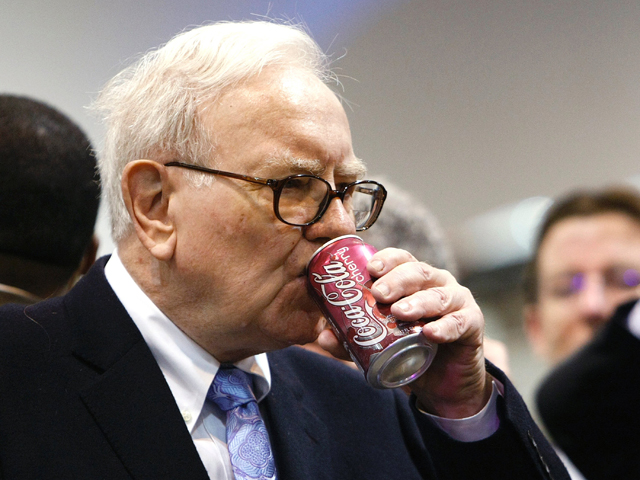
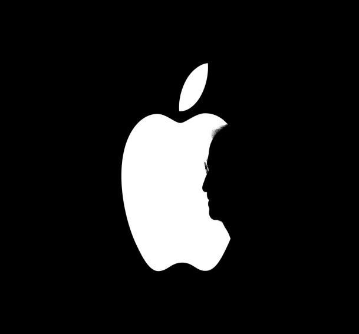

# Nova Coca Cola do Warren Buffett!

Autor: Hsia Hua Sheng (Professor de Finanças Aplicadas da FGV-EAESP)

Data 26/Fevereiro/2018

Vender Iphone mais popular, mais padronizado e mais barato continua sendo uma das estratégias atuais de expansão da Apple. A notícia da Apple em negociar diretamente com mineradoras a compra de Cobalto fundamenta essa tese. Normalmente, quem negocia com a mineradora é empresas de bateria que usam cobalto para prolongar vida útil e durabilidade nas suas baterias de íons de lítio.

As empresas de smartphone sabem bem impacto de experiência de usuários não é só com as funções inteligentes e maravilhosas de aparelho, mas também com a durabilidade de celular. O que adianta ter um aparelho ultra moderno, e bateria não “aguenta” o uso intensivo ou ter problema de “fumaça”? Além disso, o custo da bateria na composição do custo total de Smartfone está cada vez mais relevante!

Fonte: Google

A Apple está preocupada com alta de preços de cobalto. Em apenas 20 meses, o preço mais que triplicou. O preço de Cobalto era US$ 23.500,00 no dia 06/06/2016 e no dia 22/02/2018 o preço chegou US$81.500,00. A tendência é aumentar ainda mais o preço nos próximos anos. Os consumidores vão comprar muito mais carros elétricos, mais smartphones, mais parelhos de Inteligência Artificial, mais robot... Todos esses aparelhos precisam bateria de alto desempenho, com Cobalto, por enquanto. Para piorar, a oferta do Cobalto é limitada. A maior reserva do mundo fica na Republica Democrática do Congo.

Preço barato é peça fundamental para essa “commoditietização” de aparelhos modernos e inteligentes no segmento popular. Para controlar os custos, manter preço baixo com margem reduzida e aumentar o giro (venda), as empresas de todas as marcas vão padronizar os componentes e pressionar redução de custos de cadeia asiática de fornecedor de componentes eletrônicos. Agora, a batalha chegou no preço de cobalto. Hoje, aproximadamente 90% de refinamento do cobalto é feito na China. Por isso, Apple já está correndo riscos de chegar tarde nessa festa...

A negociação direta com mineradora é uma estratégia de hedge (seguro) para resultados da Apple. Proteção de preço de cobalto ajuda reduzir perda da Apple com aumento de custos de Cobalto. Se o custo de bateria aumentar devido ao aumento do preço de Cobalto, a Apple poderia usufruir ganhos a partir de preço “fixo” firmado com mineradora. Além disso, a Apple garante fornecimento físico desse metal para sua cadeia de suprimento que vai expandir volume com a entrada da Apple no segmento de Smartfones mais baratos. A certificação de origem e de procedimento de fornecedores também é importante para questão de sustentabilidade e meio ambiente.

Finalmente, Apple não está sozinha nessa batalha. Warren Buffett está com Apple. Na divulgação da carta para acionistas no dia 24/02/2018, o fundo Berkshire Hathaway administrado por Buffett possui 28 bilhões de dólares (166 milhões de ações) investidos na Apple. Inc. no final de 2017. Esse investimento corresponde aproximadamente 17% da carteira de ações do fundo. Só no ultimo trimestre de 2017, o fundo comprou 31,2 milhões de ações. Se pensar que esse fundo não tinha nenhuma ação da Apple no primeiro trimestre de 2016, o aumento de aposta do fundo em Apple Inc fica ainda mais impressionante. E você? Quer uma maça?

© 2018 Hsia Hua Sheng All Rights Reserved / © 2018 Hsia Hua Sheng todos os direitos reservados

Para citação desse artigo: SHENG, H.H. “Nova Coca Cola do Warren Buffett! ” Série de Estudo de International Financial Management (Instituto de Finanças, FGV-EAESP), No. 15, 26/02/2018, São Paulo.

Quer participar do Projeto “Ideias que Transformam”? Se você é aluno ou ex-aluno da FGV EAESP e tem “ideias que transformam” para compartilhar, envie seu artigo para o e-mail ideiasquetransformam@fgv.br. Caso seja escolhido, seu artigo poderá ser promovido pela escola e ganhar muitos leitores. http://www.fgv.br/eaesp/cursos/hsia-sheng/
