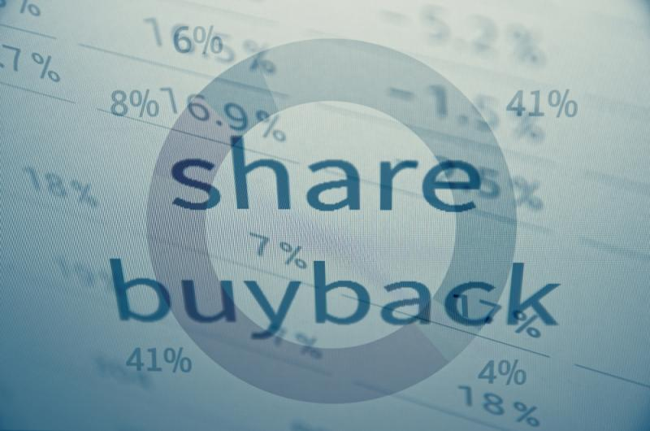

# Devolvendo dinheiro!

Autor: Hsia Hua Sheng (Professor de Finanças Aplicadas da FGV-EAESP)

Data 14/Maio/2018

Usar excesso de caixa para recomprar ações dos acionistas está na moda, em especial o mercado acionário americano. Nunca tiveram tanto anuncio de recompra de ações (Buyback or Share Repurchase) nos Estados Unidos. Só em 2018, volume total desses anúncios chega US$ 170 bilhões de dólar.

Por exemplo, a Apple vai recomprar US$ 100 bilhões. Outros gigantes do setor de tecnologia como Broadcom e Qualcomm também anunciaram recompra de U$12 Bilhões a US$ 10 bilhões. Todas essas empresas estão comprando valor corresponde aproximadamente 10% da totalidade de ações da empresa.

Mas, por que essa febre de recompra nos Estados Unidos? Muita gente deve ter pensado que as empresas estão recomprando as ações porque as ações das empresas na Bolsa estão baratas... Resposta ERRADA!

A principal razão é o resultado positivo da política de redução de imposto do Presidente Trump. Com menos imposto, as empresas geram mais lucro líquido e podem reinvestir nos projetos e produtos rentáveis aumentando suas competitividades. Em outras palavras, essa medida beneficia e fortalece saúde financeira das empresas americana gerando mais caixa livre.

Fonte da imagem: Google.com

As empresas americanas estão seguindo melhores práticas financeiras. Pela teoria financeira, quando há excesso de caixa “não esperado”, a melhor forma é usar recompra de ações para devolver caixa para seus acionistas, uma vez que não seria bom para empresa alterar sua política de dividendo só por causa de um ano atípico de excesso de caixa.

Há quem defende preservar todo excesso de caixa na empresa no lugar de devolver para acionistas. Isso pode ser verdade para pequenas e médias empresas, pois essas empresas nem sempre conseguem pegar empréstimos quando há uma boa oportunidade de investimento.

No entanto, essa restrição é bem menor para empresas gigantes que já tem sólida posição de caixa e bom modelo de negócio. Essas empresas contam com várias alternativas baratas de financiamento. As vezes, não distribuição de excesso de caixa pode gerar desconfianças dos acionistas, pois acham que os administradores podem exagerar nos investimentos da empresa. Então, devolver esse excesso para acionistas é considerado uma boa prática de governança.

A redução de capital da empresa por meio de recompra de ações também aumenta lucro por ação. Se o modelo de negócio da empresa estiver sólido, a empresa terá seu lucro igual antes. Como o número de ações é menor após a recompra de ações, então o lucro por ação (Earning per share) será maior. Isso pode levar um aumento de preço futuro de ações, dado mesma razão preço luco (Price/Eaning ratio).

Portanto, em termos de longo prazo, essa medida de recompra de ações aumentaria o valor das empresas que possuem solido modelo de negócio. Mas, nem sempre recompra de açãoes aumenta valor da empresa. É preciso tomar cuidado com as empresas espertas que não tem solido negócio e só usam recompra de ações para “embelezar” demonstrações financeiras!

“Este artigo expressa a opinião do autor, não representando necessariamente a opinião institucional da FGV” © 2018 Hsia Hua Sheng All Rights Reserved / © 2018 Hsia Hua Sheng todos os direitos reservados

Para citação desse artigo: SHENG, H.H. “Devolvendo Dinheiro!” (Núcleo de Estudos de International Financial Management, FGV-EAESP), No. 27, 04/05/2018, São Paulo.

Quer participar do Projeto “Ideias que Transformam”? Se você é aluno ou ex-aluno da FGV EAESP e tem “ideias que transformam” para compartilhar, envie seu artigo para o e-mail ideiasquetransformam@fgv.br. Caso seja escolhido, seu artigo poderá ser promovido pela escola e ganhar muitos leitores. http://www.fgv.br/eaesp/cursos/hsia-sheng/
