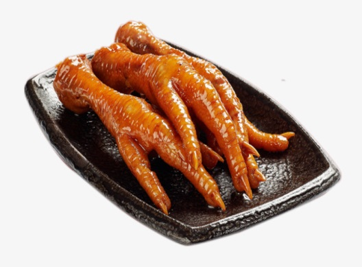

# “Flangos” não são iguais!!!

Autor: Hsia Hua Sheng (Professor de Finanças Aplicadas da FGV-EAESP)

Data 11/Junho/2018

Para quem gosta de usar múltiplos para calcular valor de uma empresa, identificar empresas comparáveis é fundamental para sucesso dessa técnica. Na última semana, os investidores não tiveram mais dúvida de que as maiores empresas de alimentos brasileiras não são comparáveis.

Desde operacao carne fraca de marcço de 2017, o preço de carne de frango já caiu 10% (no mesmo periodo, a carne so caiu 5%). O embargo da União Europeia a 20 frigoríficos brasileiros piorou essa situação com mais uma queda de preço de frango. Desde 16/05/2018 estão proibidos de vender cortes de frango ao bloco. Isso provocou também mais uma queda de preço das ações das empresas do setor, principalmente o da BRF, uma vez que ela teve 12 plantas vetadas pelos europeus.

A decisão da China de aplicar uma tarifa antidumping sobre frangos de corte importados do Brasil na última sexta-feira 08/06/2018 causou efeitos bem distintos entre as ações das maiores empresas nacionais. Embora essa decisão possa ser revista com a visita do comitê da China ou com a negociação entre governos brasileiro e chinês, o mercado acionário imediatamente refletiu essa notícia nos preços dessas empresas.

Fonte de imagem: Google.com

A BRF por ser a maior exportadora de carne de frango do Brasil sofreu mais com essa notícia. As ações da BRF (Dona das marcas Sadia e Perdigão) caíram 7,49% na B3, cotada no fechamento a R$21,50. Diferente da BRF, a JBS (Dona da marca Seara) é menos dependente da produção de frango no Brasil e pode exportar frango para China por meio de sua controlada empresa americana Pilgrim’s Pride. Por isso, na contra mão da BRF, as ações da JBS subiram 4,14% e fechou R$ 8,80 na última sexta-feira.

O impacto nas ações depende não só volume e local de exportação de frango, mas também o tipo de corte de carne de frango na composição de exportação. Segundo especialistas do setor, os cortes da carne de frango da BRF possuem preço mais alto, pois exportam mais pé de frango na sua composição de exportação. Pé de galinha é um alimento tradicional e popular na China. Já a JBS exporta mais cortes de baixo valor agregado para mercado da China. Por isso, a alíquota entre as empresas são diferentes. A alíquota a ser aplicada nos produtos da BRF será de 25,3% e a alíquota dos produtos da JBS será de 18,8%.

Portanto, os investidores vão precisar de ajustes significativos de múltiplos para tornar essas empresas “comparáveis” financeiramente. Em outras palavras, isso vai exigir mais arte que a ciência para igualar “Pé de Flango” e “Peito de Flango”...

Este artigo expressa a opinião do autor, não representando necessariamente a opinião institucional da FGV” © 2018 Hsia Hua Sheng All Rights Reserved / © 2018 Hsia Hua Sheng todos os direitos reservados

Para citação desse artigo: SHENG, H.H. ““Flangos” não são iguais!!!” (Núcleo de Estudos de International Financial Management, FGV-EAESP), No. 31, 11/06/2018, São Paulo.

Quer participar do Projeto “Ideias que Transformam”? Se você é aluno ou ex-aluno da FGV EAESP e tem “ideias que transformam” para compartilhar, envie seu artigo para o e-mail ideiasquetransformam@fgv.br. Caso seja escolhido, seu artigo poderá ser promovido pela escola e ganhar muitos leitores. http://www.fgv.br/eaesp/cursos/hsia-sheng/

https://portaldbo.com.br/guerra-comercial-pode-nao-ser-boa-para-o-brasil-diz-professor/

DESTAQUES AGRO / VER TODOS OS ARTIGOS DESSA CATEGORIA

Guerra comercial pode não ser boa para o Brasil, diz professor

Cadeias que dependem da soja e de seus subprodutos devem sofrer com aumento de custos

Portal DBO - 20/06/2018

Hsia Hua Sheng

Por Thuany Coelho

Se em um primeiro momento o impacto da guerra comercial entre Estados Unidos e China pode ser positivo para o Brasil, com aumento dos prêmios e da demanda pela soja por parte dos chineses, com o tempo – e a entrada de outros países e blocos nessa disputa -, essa balança pode se inverter e o Brasil sair prejudicado. Essa é a avaliação de Hsia Hua Sheng, professor de finanças aplicadas da Escola de Administração de Empresas de São Paulo, mantida pela Fundação Getúlio Vargas (FGV-EAESP). Em entrevista ao Portal DBO, ele explica os possíveis efeitos da briga:

Portal DBO: O que essa guerra comercial representa para o comércio global de commodities agropecuárias?

Hsia Hua Sheng: São vários efeitos. Quando todos os países começam a fazer guerra comercial – porque essa disputa não é mais só China e Estados Unidos, mas também com União Europeia e Nafta (Tratado Norte-Americano de Livre Comércio), e a própria América Latina, indiretamente, faz parte -, a primeira coisa que vai acontecer é aumento de inflação em todos os lugares. Isso quer dizer que a taxa de juros vai subir, porque os bancos centrais vão aumentá-la para combater a inflação. E, a partir disso, tem efeito no crescimento econômico. Com as taxas de juros elevadas, a economia começa a se retrair e isso afeta os preços das commodities.

E para o agronegócio brasileiro? Ele ganha com isso?

Para a soja seria interessante, porque o Brasil com certeza vai exportar mais para a China e o preço dos prêmios vão ser maiores, porque os chineses vão preferir comprar mais do Brasil do que dos EUA por causa da diferença das tarifas.

Mas isso vai gerar problemas também. Como a soja brasileira vai ficar mais cara, as cadeias que dependem dela vão ter aumento de custos. Isso quer dizer que a criação de porcos e frangos, principalmente, vão perder competitividade. E quem vai ganhar? Os criadores de frangos e suínos da União Europeia e países asiáticos, porque vão poder importar soja mais barata dos Estados Unidos [que deixou de ser enviada para a China por causa das tarifas] e depois exportar para a China. Você tem um efeito bom do lado da soja, mas péssimo para a cadeia posterior, como a de criação de frangos e suínos, porque vai ficar caro. Não vai ter como competir, até por causa das tarifas temporárias de exportação de frango para a China [por causa das acusações de concorrência desleal da proteína brasileira].

Com esse aumento da demanda chinesa pela soja brasileira, o Brasil não ficaria dependente demais da China?

Sim, mas a rentabilidade é boa. Porém o maior problema não é agora. A questão não é dependência da China, é o produtor, ao ver o prêmio extra, anormal desse ano, se animar e achar que é bom plantar mais. E daí, no final do ano que vem, o Trump resolve reverter tudo e quem vai quebrar é o produtor brasileiro, porque já aumentou a produção e não vai ter para quem vender o excedente. Um tweet do Trump, falando que acabou a guerra comercial, pode mudar tudo de um dia para outro. Esse é o maior perigo.

E no caso da carne bovina? O Brasil poderia ganhar mercado?

Na carne bovina, o impacto é igual para todo mundo, então só vai aumentar a inflação para a própria China. Só vão pagar mais caro na carne.

Você acredita que essa disputa se manterá por muito tempo ou EUA e China devem chegar a um acordo?

Eu, particularmente, não acho que essa guerra vai ser tão grave assim. Ainda acho que há espaço para EUA e China chegarem a um consenso. Vai reduzir déficit comercial entre os dois países? Sim, mas, por outro lado, se os EUA começarem a tributar os componentes de smartphones e outros eletrônicos, a inflação vai aumentar para os próprios norte-americanos, com a taxa de juros acompanhando a alta. E segundo: as empresas americanas que exportam seus componentes para a China também terão problemas. Vai exportar para quem todos esses chips? E o mercado chinês é um grande consumidor da Apple, por exemplo. E isso pode puxar as ações de tecnologia para baixo, ou seja, pode estourar a bolha nos EUA. E aí é ruim para os americanos. Não acho vantajoso também para eles.

Dado isso, acho que ainda tem espaço, porque a primeira fase de implementação começa em 6 de julho, então tem tempo. Acho que vão chegar a um consenso. No máximo esses US$ 50 bilhões em tarifas, não deve ir para US$ 200 bilhões. Não é bom para nenhum dos dois. Então ou China ou EUA dão um passo para trás ou os dois recuam, que deve ser o cenário mais provável. O próprio Trump não colocou smartphones na etapa 1, ninguém sabe quando ele vai tributar esses componentes, então ele também está pensando assim, que não pode estourar a bolsa americana por causa de ações de tecnologia.

E o que aconteceria em um cenário de guerra comercial mais generalizada?

Se a guerra fosse restrita apenas a China e Estados Unidos, o Brasil seria o mais beneficiado. Mas se começar a brigar e a União Europeia também levar a sério, daí o Brasil vai ser o maior perdedor, ao lado do resto da América Latina. Porém, por enquanto, as tarifas da UE foram mais paliativas, mais para dizer “não gostei” [das taxas impostas pelos EUA sobre aço e alumínio].

Com essa bagunça que está acontecendo, todos os países estão repensando quem são seus verdadeiros parceiros comerciais e vão ocorrer realocações nesse sentido. E aí Brasil e América Latina correm riscos de serem marginalizados, porque os preços das commodities são muito sensíveis a possíveis quedas nas atividades econômicas globais e realocação de parceiros. Com menor necessidade de uso de matéria-prima, por exemplo, os mais penalizados serão os exportadores de commodities, como o Brasil (o que pode reduzir ainda mais a estimativa do PIB para 2018). Então é o momento de o país brigar por seu lugar no comércio global e na fatia de investimentos estrangeiros diretos.

Fonte: Portal DBO.
