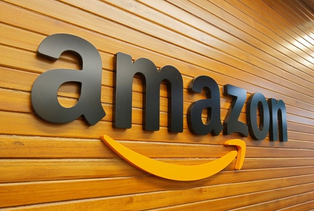

# Quem vai ser dono do varejo no Brasil?

Autor: Hsia Hua Sheng (Professor de Finanças Aplicadas da FGV-EAESP e da UNIFESP-EPPEN)

Data 02/Julho/2018

Em meio dessa guerra comercial global, queda de bolsas de valores nos mercados emergentes, crise no mercado de dívidas e onda desvalorização dos principais moedas de mercado emergentes, as empresas estão se organizando para focar no mercado interno, reestruturando segmentos de vendas e reorganizando parceiros comercias.

No Brasil, esse movimento já começou. A BRF anunciou que está focando nosso mercado interno na semana passada. A empresa vai desfazer seus investimentos na Argentina, Europa e Tailandia para pagar suas dívidas e só vai concentrar trading com seus principais parceiros no mercado asiático e mulçumano. Essa medida vai beneficiar a BRF trazendo mais foco na rentabilidade e maior giro, e menos alavancagem financeira e menos exposição a Guerra comercial.

Fonte da Imagem: Google.

Na semana passada, a B3 (Somos Brasil. Somos Bolsa. Somos Balcão.) começou a estudar o que pode ser feito para incentivar as aberturas de capital de empresas de tecnologias no Brasil. A guerra global estendeu claramente para o campo de alta tecnologia com a proibição de investimento chinês para o setor de tecnologia americana. Essa proibição pode favorecer criação dos novos centros de pesquisas de tecnologias em outros países no mundo. Os investidores desses “Start-ups” vão precisar de outros mercados de capitais para fazer seus IPOs, principalmente nos mercados onde suas aplicações tecnológicas são usadas.

Esse movimento de reorganização também está acontecendo no próprio Estados Unidos. Na última semana, a gigante empresa de tecnologia americana Amazon anunciou que vai comprar o grupo online de farmácias PillPack que atua no setor de saúde nos Estados Unidos. Essa empresa é especialista em vender e entregar remédio online, e avisa e acompanha paciente o uso de remédio via APP. Essa entrada de Amazon promoverá mais fusões e aquisições nesse setor. As principais empresas desse setor sofreram perdas expressivas no dia do anúncio, Walgreens Boots Alliance Inc (Ela acabou de substituir GE no Índice de Dow Jones) caiu 6,56%, Outra rede de farmácia CVS Health também caiu 4,27% no dia.

Portanto, essa briga por mercado interno promete marcar uma onda de fusões e aquisições no Brasil. Quem vai comprar quem os setores de varejos de alimentos, remédios e vestuários no Brasil? Empresas de E-Comerce ou de Lojas físicas ou de commodities? Ou os novos players: Empresas do Sistemas de Pagamentos e Fintechs...

Para citação desse artigo: SHENG, H.H. “Quem vai ser dono do varejo no Brasil?” (Núcleo de Estudos de International Financial Management, FGV-EAESP), No. 34, 02/07/2018, São Paulo.

Quer participar do Projeto “Ideias que Transformam”? Se você é aluno ou ex-aluno da FGV EAESP e tem “ideias que transformam” para compartilhar, envie seu artigo para o e-mail ideiasquetransformam@fgv.br. Caso seja escolhido, seu artigo poderá ser promovido pela escola e ganhar muitos leitores. http://www.fgv.br/eaesp/cursos/hsia-sheng/
