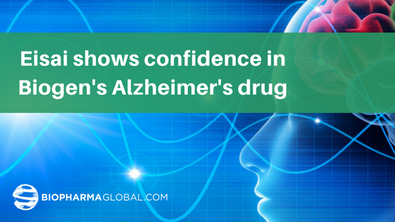
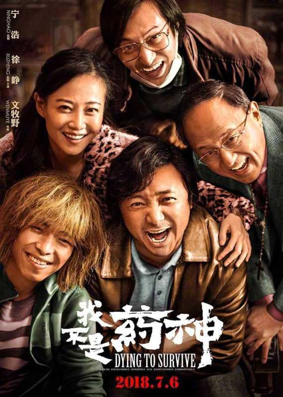

# Remédio Salva Bolsa!

Autor: Hsia Hua Sheng (Professor de Finanças Aplicadas da FGV-EAESP e da UNIFESP-EPPEN)

Data 09/Julho/2018

Na última sexta feira, começou oficialmente a guerra comercial entre Estados Unidos e a China. Nessa primeira fase, são tarifas de US$ 34 Bilhões de cada lado que entraram em vigor. Mais uma tarifa de US$ 16 bilhões podem entrar em vigor dentro de duas semanas. Os outros blocos comerciais estão analisando a situação e decidindo o que fazer? Qual lado ficar nessa guerra comercial? Ou ficar neutro para aproveitar as oportunidades nos dois lados?

O mercado financeiro parece que já tinha absorvido esse cenário pessimista nos preços dos ativos. Os principias índices de ações, bonds, moedas e commodities pararam de piorar e ficaram estáveis na última sexta feira... O que chamou bastante atenção foi o desempenho das Bolsas asiáticas!!! Como a China monta dos componentes provenientes de outros países asiáticos e depois exporta para Estados Unidos, essa guerra também prejudicaria esses países vizinhos. Mas, isso não aconteceu. A maioria dessas Bolsas fechou em leve alta.

Uma das principais razões foi bom desempenho das empresas da indústria farmacêutica. Uma razão é o fortalecimento de mercado interno para laboratórios locais com maior protecionismo global. A China, por exemplo, embora haja um sistema de saúde público para consulta médica, mas os preços de remédio subiram muito nos últimos anos. Com o aumento de renda, as famílias chinesas passaram ter mais condições para gastar com remédios caros e de maior eficiência. Essas famílias também estão consumido mais remédio do uso continuo para combate de doenças crônicas. Isso cria oportunidades para laboratórios de todos tipos: genéricos, novos remédios e medicinas chinesas.

Imagem: Google.com

Outra razão é a descoberta de Um teste experimental de um novo remédio de Alzheimer mostrou resultados positivos. Esses resultados sinalizam que os laboratório estariam próximo de encontrar medicamento que interrompa ou reduz significativamente a incidência e na progressão da doença da Alzheimer e demência. Esse progresso foi principal responsável pelo aumento de preços de ações da Bonston Biotech Biogen Inc. (BIIB 19,63%) e empresa japonesa EisaiCo. (ESALY 21,52%).

Olhando para indústria farmacêutica no mercado de ações brasileiras, a maioria ainda é distribuidora ou rede de drogarias. Há oportunidades e espaços para laboratórios e fabricantes de medicamentos. Quem sabe os processos que foram suspensos devido à fraca demanda no inicio do ano (ex. Blau Farmacêutica) e os outros processo que iam fazer IPO não possam ser retomados....

Para citação desse artigo: SHENG, H.H. “Remédio Salva Bolsa” (Núcleo de Estudos de International Financial Management, FGV-EAESP), No. 35, 09/07/2018, São Paulo.

Quer participar do Projeto “Ideias que Transformam”? Se você é aluno ou ex-aluno da FGV EAESP e tem “ideias que transformam” para compartilhar, envie seu artigo para o e-mail ideiasquetransformam@fgv.br. Caso seja escolhido, seu artigo poderá ser promovido pela escola e ganhar muitos leitores. http://www.fgv.br/eaesp/cursos/hsia-sheng/
