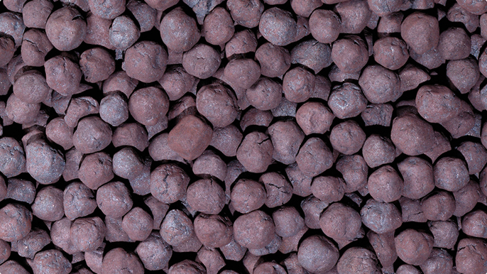

# Preço de minério de ferro está aumentando?

Autor: Hsia Hua Sheng (Professor de Finanças Aplicadas da FGV-EAESP e da UNIFESP-EPPEN)

Data 23/Setembro/2018

O preço é importante referencia sobre oferta e demanda de um produto. Em geral, os analistas financeiros usam preço internacional para avaliar movimento de um determinado commoditie internacional. Mas, qual preço que eles estão falando? Em US$? Em R$? ou Em RMB$?

Como dólar americano ainda é usado predominantemente no comercio mundial, o ideal é analisar os preços em dólar americano para não misturar a tendência de preço de commoditie em US$ com os efeitos de variação cambial da moeda não dólar.

Por exemplo, será que podemos afirmar que a tendência de preço de minério de ferro global é mais alta por que está mais caro o preço dos contratos futuros do minério de ferro na bolsa de mercadoria de Dalian na China? Isso pode abrir espaço de imaginação para o aumento de preço das ações da Vale, pois a geração de caixa da Vale poderá ser maior...

Fonte da Imagem: Google

É preciso tomar muito cuidado com esse tipo de analise. Se olhar com mais cuidado, os analistas vão perceber que o preço de contrato futuro com data de vencimento em janeiro de 2019, o de maior liquidez e mais representativo no mercado, está expresso em moeda chinesa RMB (Iuanes) por tonelada. Em outras palavras, se houver uma desvalorização de RMB no dia da consulta, aquele aumento de preço de minério de ferro pode ser um simples reflexo de desvalorização de RMB e não um aumento de demanda no mercado interno da China.

Esses ajustes “automáticos” de preço expresso em diferentes moedas em Bolsas do mundo são garantidos pela teoria de não arbitragem na área de finanças internacionais. Quando há uma desvalorização de RMB, os preços de contrato futuro em RMB na China ficam mais baratos que os preços internacionais em US$, logo os investidores vão querer comprar mais barato na China para vender mais caro no mercado internacional. Consequentemente os preços na China aumentam até que os preços em RMB e US$ se equiparam.

Portanto, é muito importante decompor os preços de commoditie em moedas não US$ americanos para saber qual é a verdadeira causa de queda ou aumento de preço. É do próprio commoditie ou da própria moeda?

Este artigo expressa a opinião do autor, não representando necessariamente a opinião institucional da FGV” © 2018 Hsia Hua Sheng All Rights Reserved.

Para citação desse artigo: SHENG, H.H. “América First” (Núcleo de Estudos de International Financial Management, FGV-EAESP), No. 46, 23/09/2018, São Paulo.

Quer participar do Projeto “Ideias que Transformam”? Se você é aluno ou ex-aluno da FGV EAESP e tem “ideias que transformam” para compartilhar, envie seu artigo para o e-mail ideiasquetransformam@fgv.br. Caso seja escolhido, seu artigo poderá ser promovido pela escola e ganhar muitos leitores.http://www.fgv.br/eaesp/cursos/hsia-sheng/
