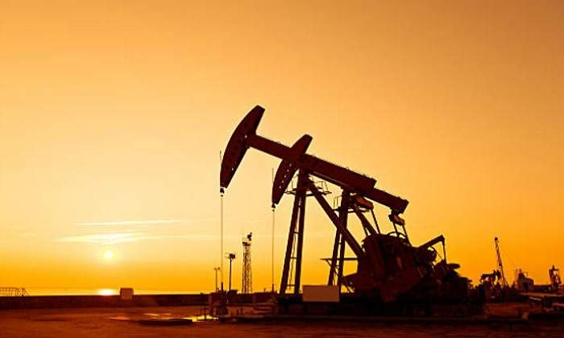

# Para onde vai o preço de petróleo?

Autor: Hsia Hua Sheng (Professor de Finanças Aplicadas da FGV-EAESP e da UNIFESP-EPPEN)

Data: 18/Novembro/2018

Mudanças radicais estão marcando o mercado de petróleo. Até um mês atrás, o mercado esperava o preço do petróleo WTI (West Texas Intermediate) batendo acima de US$ 100,00. O que aconteceu foi examente o contrário. O preço de WTI era de US$75, agora está por volta de US$ 55. Por que essa queda especular? Se o mundo consome mais e demanda mais petróleo no quarto trimestre que no terceiro trimestre.

A resposta para essa pergunta não está na demanda e sim está na oferta. Estamos com excesso de oferta de petróleo. O primeiro é a guerra comercial entre USA e China que está levando um desaquecimento global de economia. O PIB desses dois países tem um peso preponderante tanto na participação quando no crescimento. A continuidade dessa briga só piora demanda de petróleo e não beneficia ninguém (Quem sabe o Presidente Trump e o Presidente Xi cheguem um acordo no G20 para bem da economia mundial!!!).

Fonte: imagem Google

O segundo é necessidade de maior controle de inflação nos Estados Unidos. Maior inflação americana aumenta probabilidade e frequência de aumento de taxa de juros americana pelo FED. E consequentemente reduziria o potencial crescimento econômico promovido pelo governo Trump. Essa seria uma ameaça ao planejamento da reeleição do Presidente Trump no próximo ano. Por isso, o próprio Estados Unidos tem aumentado sua própria produção de petróleo de xisto, assumindo o posto de maior produto de petróleo no mundo em alguns meses de 2018.

O terceiro é cooperação com os grandes produtores mundiais de petróleo. Por razões políticas distintas, a Arábia Saudita e Rússia não chegaram um acordo para reduzir produção diária. Apesar das sanções comerciais e econômicas integrais americanas, o Irã é permitido exportar excepcionalmente petróleo para alguns aliados e o principal rival dos Estados Unidos. Além da China, Grécia, Índia, Itália, Turquia, Coreia do Sul, Taiwan e Japão poderão manter as importações de petróleo iraniano por outros seis meses. Portanto, a produção continua elevada.

Se esse cenário não mudar, o mercado já está precificando a manutenção dessa queda ate final do ano. O preço de contrato futuro o preço dos contratos de futuros mais longo, em termos de data de vencimento, está mais elevado do que o preço dos contratos de futuros mais próximos. Logo, o mercado está em contango – já que, com a aproximação do vencimento, a cotação do petróleo tende a cair até preço spot do ativo, uma vez que o preço spot esperado no futuro é menor que o preço futuro hoje negociado.

Portanto, com essa mudança de fundamento do petróleo, o mercado vem posicionando seguinte: vender as ações das empresas de petróleo e petroquímicas, comprar setores que tem grande insumo de petróleo, por exemplo, as ações de companhias aéreas.

Este artigo expressa a opinião do autor, não representando necessariamente a opinião institucional da FGV” © 2018 Hsia Hua Sheng All Rights Reserved.

Para citação desse artigo: SHENG, H.H. “ Pra onde vai o preço de petróleo?” (Núcleo de Estudos de International Financial Management, FGV-EAESP), No. 54, 18/11/2018, São Paulo.

Quer participar do Projeto “Ideias que Transformam”? Se você é aluno ou ex-aluno da FGV EAESP e tem “ideias que transformam” para compartilhar, envie seu artigo para o e-mail ideiasquetransformam@fgv.br. Caso seja escolhido, seu artigo poderá ser promovido pela escola e ganhar muitos leitores.http://www.fgv.br/eaesp/cursos/hsia-sheng/
