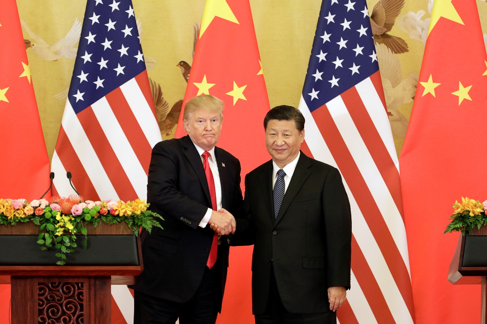

# G20

Autor: Hsia Hua Sheng (Professor de Finanças Aplicadas da FGV-EAESP e da UNIFESP-EPPEN)

Data: 03/Dezembro/2018

A reunião G20 que aconteceu na Buenos Aires deu um novo ânimo a economia mundial. Presidente Trump e Presidente Xi concluem trégua comercial no G20. O governo americano renunciava temporariamente (por um perido de 90 dias) ao aumento tarifário de 10% a 25% sobre 200 bilhões de dólares em produtos importados da China – metade do total – a partir de 1º de janeiro.

A questão Central não era tanto a questão da decisão temporaria, e sim o gesto dos dois Líderes mundiais em dialogar. O mercado já estava precificando os preços dos ativos para um cenário pior, isto é ruputura total na questão comerciais entre Estados Unidinos e a China. Os sinais de uma “catastrofe” estavam em todos os lugares...os preços da maioria dos commodities cairam entre 20% e 30% nas ultimas semanas. As ações de tecnologias nas Bolsas americanas e chinesas também cairão significativamente nesse período...

Fonte da Imagem: Google/Exame

Após esse essa reaproximação, o mercado entende que vai demorar para resolver essas divergencias entre os dois países, mas tanto Estados Unidos quento a China estão dispostos a conversar sempre e sem tomar um rumo unilateral radical. Isso representa uma nova regra que o economia mundial vai precisar absorver e conviver com mais volatilidade.

E para o Brasil? O efeito é “mixado”. Sem duvida, mais demanda para petroleo e minerio e celulose e papel significa maior preço mais crescimento para esses setores. Por outro lado, a demanda e os premios pelos produtos de agronegocio brasileiro, tais como carne, porco, soja e milho, podem cair com essa reaproximação comercial entre Estados Unidos e a China. Portanto, mais desfios para diplomatas brasieliros e chineses.

Este artigo expressa a opinião do autor, não representando necessariamente a opinião institucional da FGV” © 2018 Hsia Hua Sheng All Rights Reserved.

Para citação desse artigo: SHENG, H.H. “G20” (Núcleo de Estudos de International Financial Management, FGV-EAESP), No. 56, 26/11/2018, São Paulo.

Quer participar do Projeto “Ideias que Transformam”? Se você é aluno ou ex-aluno da FGV EAESP e tem “ideias que transformam” para compartilhar, envie seu artigo para o e-mail ideiasquetransformam@fgv.br. Caso seja escolhido, seu artigo poderá ser promovido pela escola e ganhar muitos leitores.http://www.fgv.br/eaesp/cursos/hsia-sheng/
